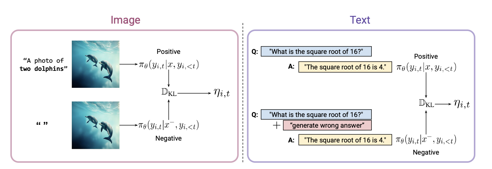

# Official Implementation: Guidance Contrastive Token Credit Assignment for Discrete Policy Optimization

This repo we implements the GCPO algorithm 


### Installation

```bash
git clone https://github.com/hiyouga/EasyR1.git
cd EasyR1
pip install -e .
```

###  Training for VLMs

To train Qwen3-VL-8B, run

```bash
bash examples/gcpo_8b.sh
```

To train Qwen2.5-VL-7B, run

```bash
bash examples/gcpo_7b.sh
```

### Training for Text-to-Image Generation

See [t2i/readme.md](t2i/readme.md)


### Model Checkpoints

[Janus-Pro-7B-GCPO](https://huggingface.co/KonstantinosKK/Janus-Pro-7B-GCPO)

[Qwen3-VL-8B-GCPO](https://huggingface.co/jacklishufan/Qwen3-VL-8B-GCPO/tree/main)